# 🛍️ Product Management System

A full-stack product management application with infinite scroll functionality, built with Next.js, Express.js, and MongoDB.
---


---

## 📸 Application Screenshots

### Hero Section & Overview
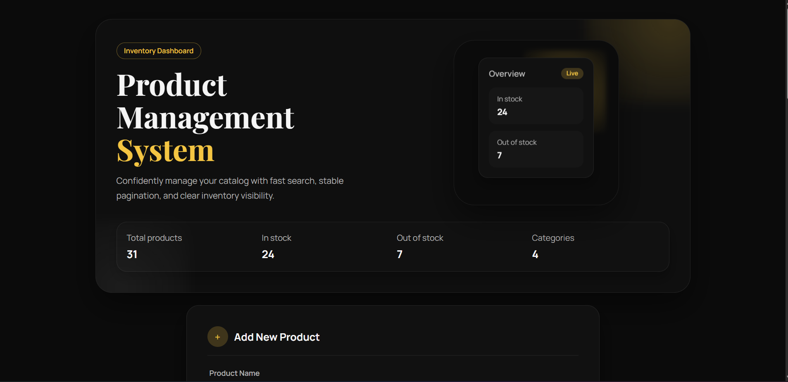

### Product Display
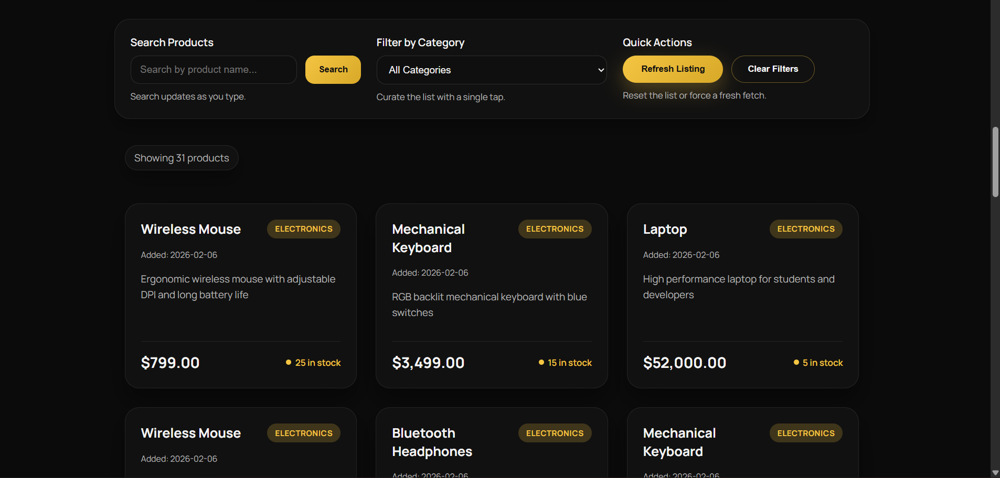

### Add Product Form
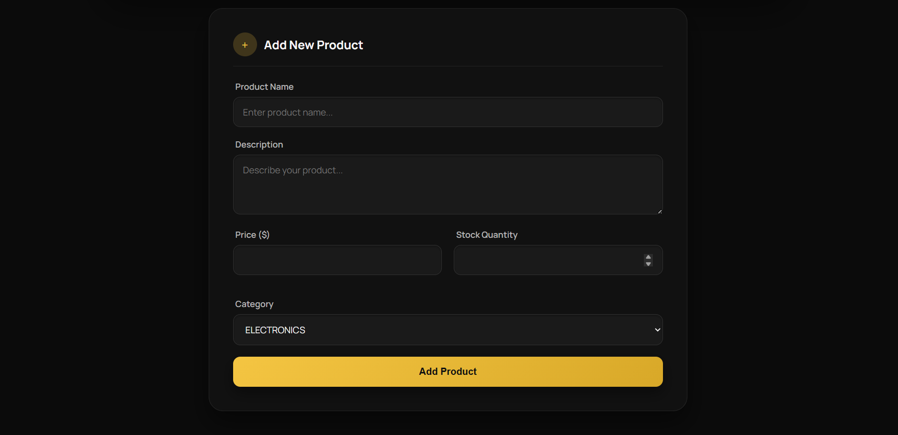

---

## 📋 Table of Contents

- [Overview](#-overview)
- [Tech Stack](#-tech-stack)
- [Features](#-features)
- [Architecture](#-architecture)
- [Project Structure](#-project-structure)
- [How Infinite Scroll Works](#-how-infinite-scroll-works)
- [Data Flow](#-data-flow)
- [Setup Instructions](#-setup-instructions)

---

## 🎯 Overview

This is a modern product management system that allows users to:
- ✨ View products with infinite scroll
- 🔍 Search products by name
- 🏷️ Filter products by category
- ➕ Add new products with validation
- 📊 View inventory statistics
- 📱 Responsive design that works on all devices

---

## 🛠️ Tech Stack

### Frontend
- **Next.js** - React framework with Server-Side Rendering
- **React** - UI library
- **TypeScript** - Type safety throughout the application
- **CSS Modules** - Scoped component styling
- **Axios** - HTTP client for API calls

### Backend
- **Express.js** - Web framework for Node.js
- **TypeScript** - Type-safe backend development
- **MongoDB** - NoSQL database
- **Mongoose** - MongoDB object modeling

### Key Technologies
- **Cursor-Based Pagination** - Efficient infinite scroll
- **Server-Side Rendering** - Fast initial page load
- **Error Boundaries** - Graceful error handling
- **Input Validation** - Both client and server-side

---

## ✨ Features

| Feature | Description |
|---------|-------------|
| 📜 **Infinite Scroll** | Automatically loads more products as you scroll |
| 🔍 **Real-Time Search** | Debounced search by product name |
| 🏷️ **Category Filter** | Filter by Electronics, Clothing, Books, Food |
| ➕ **Add Products** | Create new products with validation |
| 📊 **Inventory Dashboard** | Live stats for total, in-stock, and out-of-stock items |
| 🎨 **Responsive UI** | Works seamlessly on desktop, tablet, and mobile |
| ⚡ **Fast Loading** | Server-side rendering with optimized pagination |
| 🛡️ **Error Handling** | Graceful error boundaries and user feedback |
| 🔒 **Type Safety** | Full TypeScript implementation (strict mode) |

---

## 🏗️ Architecture

### System Architecture

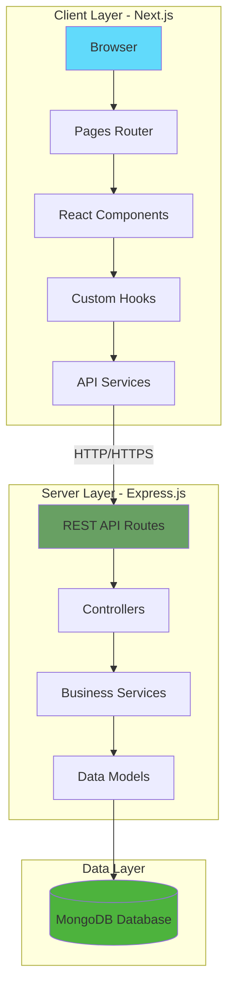

### Architecture Layers

**Client Layer (Next.js + React)**
- **Pages**: Handle routing and Server-Side Rendering
- **Components**: Reusable UI elements (ProductCard, ProductList, AddProductForm)
- **Custom Hooks**: Data fetching and state management (useInfiniteProducts)
- **Services**: API communication with the backend

**Server Layer (Express.js)**
- **Routes**: Define API endpoints
- **Controllers**: Handle HTTP requests and responses
- **Services**: Implement business logic and data operations
- **Models**: Define database schemas and validation

**Data Layer (MongoDB)**
- **Database**: Store and manage product data
- **Indexes**: Optimize search and filtering operations

---

## 📁 Project Structure

```
product-management/
│
├── client/                          # Frontend Application (Next.js)
│   ├── src/
│   │   ├── pages/                  # Next.js Pages & Routing
│   │   │   ├── index.tsx           # Home page (SSR)
│   │   │   ├── _app.tsx            # App wrapper with ErrorBoundary
│   │   │   ├── _document.tsx       # HTML document structure
│   │   │   └── 404.tsx             # Custom 404 page
│   │   │
│   │   ├── components/             # React Components
│   │   │   ├── ProductCard.tsx     # Individual product card
│   │   │   ├── ProductList.tsx     # Product grid with infinite scroll
│   │   │   ├── AddProductForm.tsx  # Form to add new products
│   │   │   ├── ErrorBoundary.tsx   # Error handling component
│   │   │   └── *.module.css        # Component-specific styles
│   │   │
│   │   ├── hooks/                  # Custom React Hooks
│   │   │   └── useInfiniteProducts.ts  # Infinite scroll logic
│   │   │
│   │   ├── services/               # API Communication Layer
│   │   │   └── product.service.ts  # Product API calls
│   │   │
│   │   ├── types/                  # TypeScript Type Definitions
│   │   │   └── product.types.ts    # Product interfaces
│   │   │
│   │   ├── constants/              # Application Constants
│   │   │   └── app.constants.ts    # Configuration values
│   │   │
│   │   └── styles/                 # Global Styles
│   │       ├── globals.css         # Global CSS variables & styles
│   │       ├── Home.module.css     # Home page styles
│   │       └── NotFound.module.css # 404 page styles
│   │
│   ├── public/                     # Static Assets
│   │   ├── readme-*.png            # Documentation images
│   │   └── *.svg                   # Icon files
│   │
│   ├── .env.test                   # Development environment variables
│   ├── .env.production             # Production environment variables
│   ├── .env.example                # Environment template
│   ├── next.config.ts              # Next.js configuration
│   ├── tsconfig.json               # TypeScript configuration
│   └── package.json                # Dependencies & scripts
│
├── server/                          # Backend Application (Express.js)
│   ├── src/
│   │   ├── server.ts               # Application entry point
│   │   │
│   │   ├── config/                 # Configuration Files
│   │   │   └── env.config.ts       # Environment validation
│   │   │
│   │   ├── routes/                 # API Routes
│   │   │   └── product.routes.ts   # Product endpoints
│   │   │
│   │   ├── controllers/            # Request Handlers
│   │   │   └── product.controller.ts  # Product controller
│   │   │
│   │   ├── services/               # Business Logic
│   │   │   └── product.service.ts  # Product operations
│   │   │
│   │   ├── models/                 # Database Models
│   │   │   └── Product.model.ts    # Product schema
│   │   │
│   │   ├── middleware/             # Express Middleware
│   │   │   └── error.middleware.ts # Error handling
│   │   │
│   │   ├── types/                  # TypeScript Types
│   │   │   ├── product.types.ts    # Product types
│   │   │   └── pagination.types.ts # Pagination types
│   │   │
│   │   ├── utils/                  # Helper Functions
│   │   │   └── validation.ts       # Input validation
│   │   │
│   │   └── constants/              # Application Constants
│   │       └── app.constants.ts    # Enums & constants
│   │
│   ├── .env.test                   # Development environment variables
│   ├── .env.production             # Production environment variables
│   ├── .env.example                # Environment template
│   ├── tsconfig.json               # TypeScript configuration
│   └── package.json                # Dependencies & scripts
│
├── .gitignore                       # Git ignore rules
└── README.md                        # This file
```

---

## ♾️ How Infinite Scroll Works

### Concept Overview

Infinite scroll progressively loads products as the user scrolls down, instead of loading everything at once. This application uses **cursor-based pagination** for optimal performance and data consistency.

### Why Cursor-Based Pagination?

**Traditional Offset Pagination Issues:**
- Breaks when items are added/deleted during scrolling
- Causes duplicate or skipped items
- Performance degrades with deep pagination

**Cursor-Based Solution:**
- Uses MongoDB document ID as stable reference point
- Always starts from known position
- Consistent results even with data changes
- Efficient database queries using indexed fields

### Infinite Scroll Sequence Flow

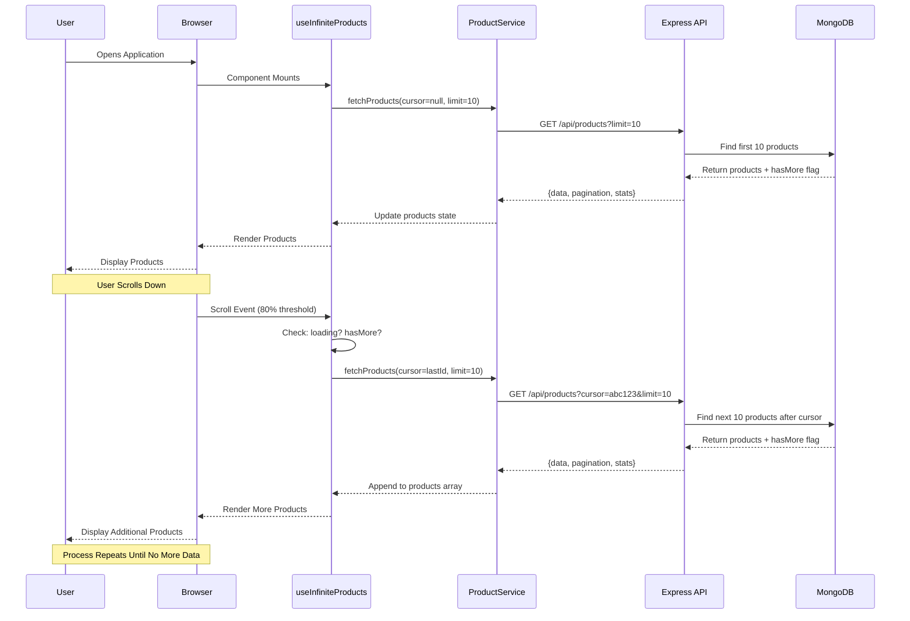

### Cursor Pagination Mechanism

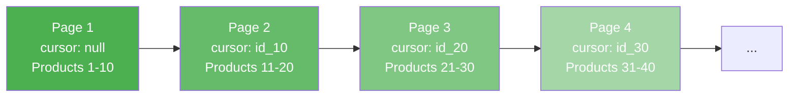

### Scroll Detection Logic

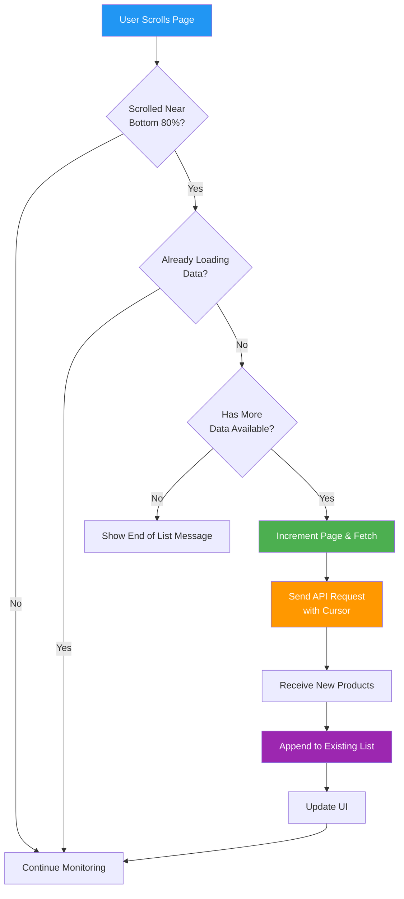

### How the Backend Handles Cursors

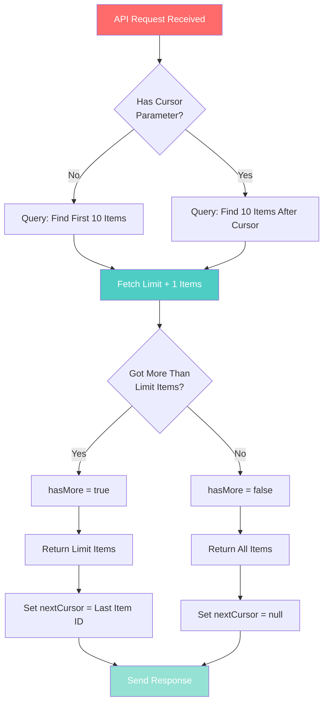

---

## 🔄 Data Flow

### Complete Application Data Flow

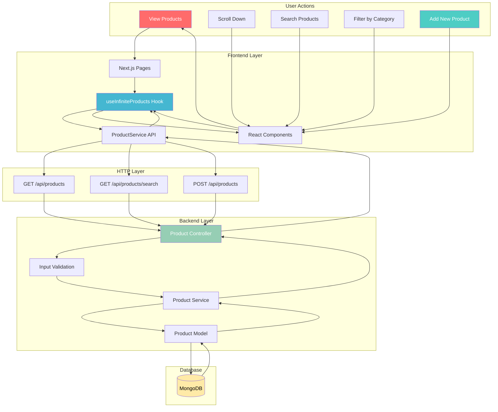

### Adding a Product - Detailed Flow

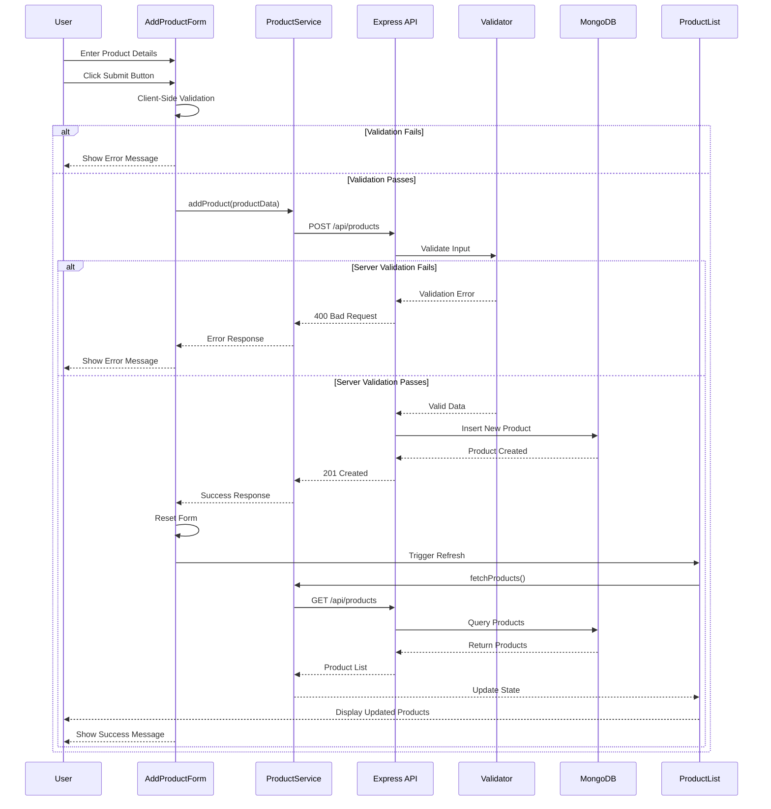

### Search and Filter Flow

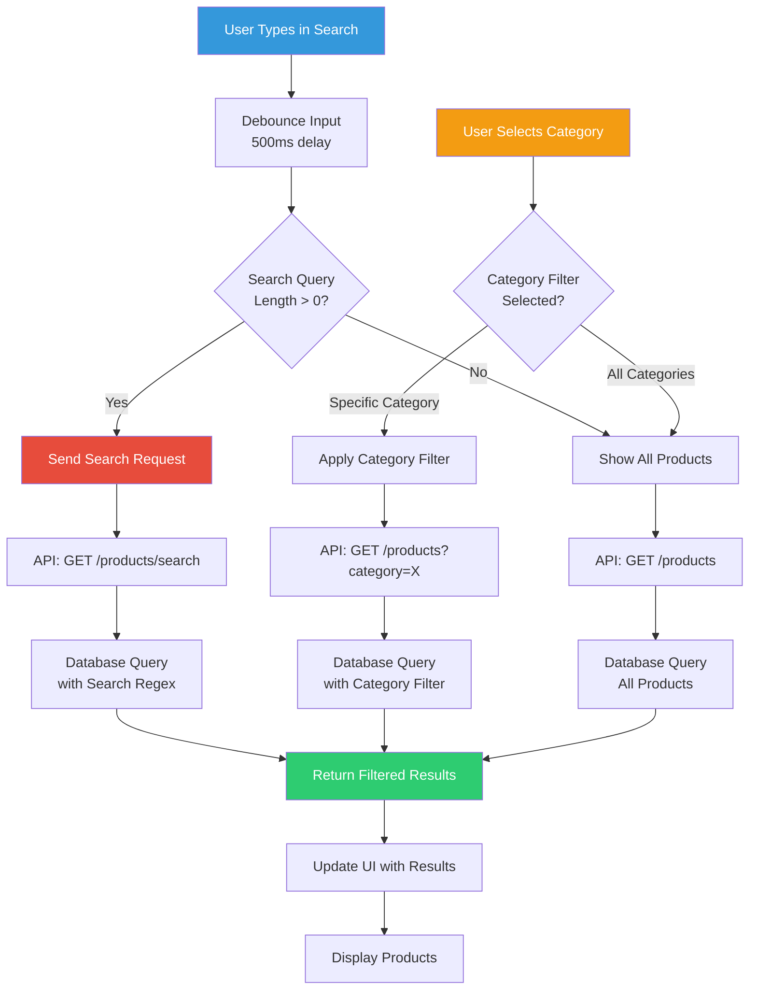

### Server-Side Rendering (SSR) Flow

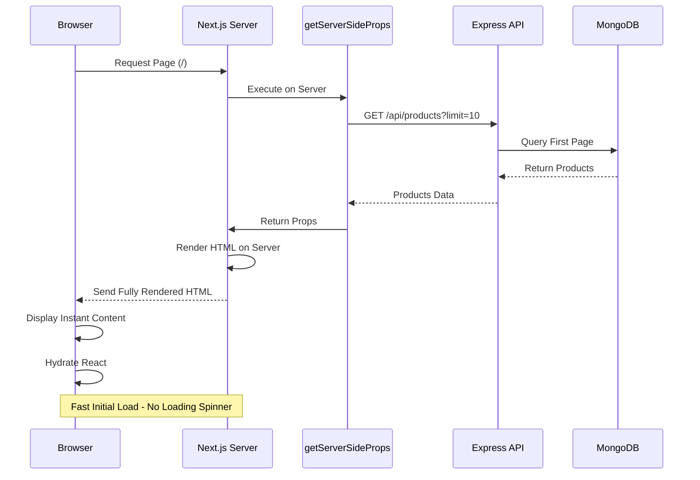

---

## 🚀 Setup Instructions

### Prerequisites

Before you begin, ensure you have the following installed on your system:

| Software | Version | Download Link |
|----------|---------|---------------|
| **Node.js** | 18 or higher | [https://nodejs.org/](https://nodejs.org/) |
| **npm** | 9 or higher | Comes with Node.js |
| **MongoDB** | 6 or higher | [https://www.mongodb.com/try/download/community](https://www.mongodb.com/try/download/community) |
| **Git** | Latest | [https://git-scm.com/downloads](https://git-scm.com/downloads) |

### Step 1: Clone the Repository

Open your terminal and run:

**Using HTTPS:**
```
git clone https://github.com/TejeswarAchari/product-management.git
cd product-management
```

**Using SSH:**
```
git clone git@github.com:TejeswarAchari/product-management.git
cd product-management
```

### Step 2: Setup MongoDB

You have two options for MongoDB:

**Option A: Local MongoDB**

1. Install MongoDB Community Edition from the link above
2. Start MongoDB service:
   - **Windows:** MongoDB starts automatically as a service
   - **macOS:** `brew services start mongodb-community`
   - **Linux:** `sudo systemctl start mongod`
3. MongoDB will be available at: `mongodb://localhost:27017`

**Option B: MongoDB Atlas (Cloud - Recommended)**

1. Create a free account at [MongoDB Atlas](https://www.mongodb.com/cloud/atlas)
2. Create a new cluster (free tier available)
3. Click "Connect" and choose "Connect your application"
4. Copy the connection string
5. Replace `<password>` with your database user password

### Step 3: Install Dependencies

**Install Server Dependencies:**
```
cd server
npm install
```

**Install Client Dependencies:**
```
cd ../client
npm install
```

### Step 4: Configure Environment Variables

**For the Server:**

Navigate to the server directory and create environment files:

```
cd server
```

Create `.env.test` file for development:
```
NODE_ENV=test
PORT=5001
MONGODB_URI=mongodb://localhost:27017/products_test
CORS_ORIGIN=http://localhost:3000
```

Create `.env.production` file for production:
```
NODE_ENV=production
PORT=5000
MONGODB_URI=your_mongodb_atlas_connection_string
CORS_ORIGIN=https://yourdomain.com
```

**For the Client:**

Navigate to the client directory and create environment files:

```
cd ../client
```

Create `.env.test` file for development:
```
NEXT_PUBLIC_API_URL=http://localhost:5001
```

Create `.env.production` file for production:
```
NEXT_PUBLIC_API_URL=https://api.yourdomain.com
```

### Step 5: Start the Development Servers

You'll need **two terminal windows** open.

**Terminal 1 - Start the Backend Server:**

```
cd server
npm run dev
```

You should see:
```
✅ Connected to MongoDB
🚀 Server running on http://localhost:5001
```

**Terminal 2 - Start the Frontend:**

```
cd client
npm run dev
```

You should see:
```
ready - started server on 0.0.0.0:3000
```

### Step 6: Access the Application

Open your web browser and navigate to:

```
http://localhost:3000
```

You should see the Product Management interface!

### Verification Checklist

✅ **Backend Running**: Visit `http://localhost:5001/api/products` - should return JSON response  
✅ **Frontend Running**: Visit `http://localhost:3000` - should display the product interface  
✅ **Database Connected**: Check server terminal for "Connected to MongoDB" message  
✅ **Add Product**: Try adding a product through the form  
✅ **Infinite Scroll**: Scroll down to load more products  
✅ **Search**: Use the search bar to filter products  
✅ **Category Filter**: Select a category from the dropdown

### Environment Switching

The application automatically loads the correct environment:

- **Development**: Uses `.env.test` files (default when running `npm run dev`)
- **Production**: Uses `.env.production` files (when running `npm start`)

### Troubleshooting

| Problem | Solution |
|---------|----------|
| **Port already in use** | Change `PORT` in server `.env.test` or stop the process using that port |
| **Cannot connect to MongoDB** | Ensure MongoDB service is running or check your connection string |
| **CORS errors** | Verify `CORS_ORIGIN` in server env matches client URL |
| **Module not found errors** | Run `npm install` in both server and client directories |
| **Page not loading** | Ensure both backend (5001) and frontend (3000) servers are running |
| **Network Error** | Backend might not be running - check Terminal 1 |

### Production Build

**Build the Backend:**
```
cd server
npm run build
npm start
```

**Build the Frontend:**
```
cd client
npm run build
npm start
```

---

## 📊 Application Features in Detail

### Inventory Dashboard
- **Total Products**: Real-time count of all products
- **In Stock**: Products with stock > 0
- **Out of Stock**: Products with stock = 0

### Product Categories
- Electronics
- Clothing
- Books
- Food

### Validation Rules
- **Product Name**: Required, max 120 characters
- **Description**: Required, max 2000 characters
- **Price**: Required, must be ≥ 0
- **Stock**: Required, must be ≥ 0
- **Category**: Required, must be valid category

---

## 🎨 Application Flow Summary

1. **Initial Load**: Next.js server renders the first page with initial products (SSR)
2. **Display**: Products are shown in a responsive grid layout
3. **Scroll Detection**: Application monitors scroll position (triggers at 80% threshold)
4. **Load More**: Fetches next page using cursor-based pagination
5. **Append**: New products are added to the existing list seamlessly
6. **Search/Filter**: Real-time filtering with debounced search
7. **Add Product**: Form validation on both client and server
8. **Refresh**: Product list updates automatically after adding new product

---

## 🔒 Security Features

- **CORS Protection**: Configured origin restrictions
- **Input Validation**: Server-side validation for all inputs
- **SQL Injection Protection**: MongoDB parameterized queries
- **XSS Prevention**: Input sanitization and escaping
- **Environment Security**: Credentials stored in .env files (git-ignored)
- **Error Handling**: No sensitive data exposed in error messages
- **Request Timeouts**: 30-second timeout to prevent hung requests

---

## 📞 Support & Contact

If you encounter any issues during setup or have questions:

- **GitHub Issues**: [Create an issue](https://github.com/TejeswarAchari/product-management/issues)
- **Email**: [vteja797@gmail.com](mailto:vteja797@gmail.com)
- **LinkedIn**: [Tejeswarachari Vadla](https://linkedin.com/in/tejeswarachari)

---

## 👨‍💻 Author

**Tejeswar Achari**

- GitHub: [@TejeswarAchari](https://github.com/TejeswarAchari)
- LinkedIn: [Tejeswarachari Vadla](https://linkedin.com/in/tejeswarachari)
- Email: [vteja797@gmail.com](mailto:vteja797@gmail.com)

---

## 📝 License

This project is open source and available for educational purposes.

---

**Happy Coding! 🚀**
